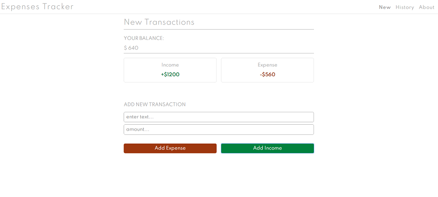

# Expense-Tracker in React

Expense-Tracker is a create react app. It was created for mobile and desktop views. App is monitoring
income and expenses of budget. It also save all data at localStorage.

## Tools & Technology used

- Visual Studio Code
- React
- Create-React-App
- ContextAPI
- useState, useEffect
- localStorage
- SASS
